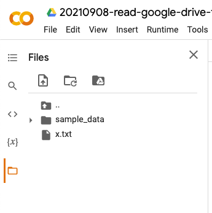
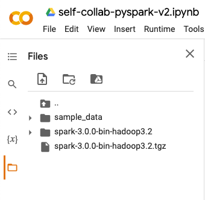

- [Download files from URL](#download-files-from-url)
- [Get files from Google Drive (private file)](#get-files-from-google-drive-private-file)
- [Start PySpark in Colab](#start-pyspark-in-colab)

# Download files from URL

```python
# find the share link of the file/folder on Google Drive
file_share_link = "https://drive.google.com/file/d/15XVdoHh7gzb2y-o5QwtZkwYSeYXUK-EY/view?usp=sharing"

# extract the ID of the file
file_id = file_share_link[file_share_link.find("d/") + 2: file_share_link.find('/view')]
print(file_id)

# append the id to this REST command
file_download_link = "https://docs.google.com/uc?export=download&id=" + file_id

# `-N` flag to skip download if files already exist in wget
# https://stackoverflow.com/questions/4944295/skip-download-if-files-already-exist-in-wget
!wget  -N -O x.txt "https://docs.google.com/uc?export=download&id=15XVdoHh7gzb2y-o5QwtZkwYSeYXUK-EY"
```

Output:



# Get files from Google Drive (private file)

```python 
from google.colab import drive
drive.mount('/content/drive')

import pandas as pd

copied_path = "/content/drive/MyDrive/.../data/Nasdaq_daily.csv"
data = pd.read_csv(copied_path)
data
```

Output:
```
	Date	Open	High	Low	Close	Volume	Adj Close
0	2016-09-01	5218.279785	5229.939941	5189.359863	5227.209961	1592520000	5227.209961
1	2016-08-31	5216.419922	5219.890137	5191.180176	5213.220215	1761770000	5213.220215
2	2016-08-30	5229.879883	5241.620117	5205.609863	5222.990234	1561020000	5222.990234
3	2016-08-29	5223.799805	5245.120117	5222.339844	5232.330078	1416640000	5232.330078
4	2016-08-26	5219.049805	5253.390137	5191.859863	5218.919922	1591060000	5218.919922
...	...	...	...	...	...	...	...
9076	1980-09-08	184.449997	184.449997	184.449997	184.449997	0	184.449997
9077	1980-09-05	185.610001	185.610001	185.610001	185.610001	0	185.610001
9078	1980-09-04	185.050003	185.050003	185.050003	185.050003	0	185.050003
9079	1980-09-03	184.529999	184.529999	184.529999	184.529999	0	184.529999
9080	1980-09-02	182.339996	182.339996	182.339996	182.339996	0	182.339996
9081 rows × 7 columns
```

# Start PySpark in Colab

Cell 1 (text):
```shell
# Setup in Collab
Collab Only code:
```

Cell 2:
```python
# innstall java
!apt-get install openjdk-8-jdk-headless -qq > /dev/null

# install spark (change the version number if needed)
## q, --quiet:	Turn off wget's output
## -N:	don't download a newer copy of a file if it exists already
!wget -q -N https://archive.apache.org/dist/spark/spark-3.0.0/spark-3.0.0-bin-hadoop3.2.tgz

# unzip the spark file to the current folder
!tar xf spark-3.0.0-bin-hadoop3.2.tgz
```



Cell 3:
```python
# set your spark folder to your system path environment. 
import os
os.environ["JAVA_HOME"] = "/usr/lib/jvm/java-8-openjdk-amd64"
os.environ["SPARK_HOME"] = "/content/spark-3.0.0-bin-hadoop3.2"
```

Cell 4:
```python
# install findspark using pip
!pip install -q findspark
!pip install pyspark==3.0.2
```

Cell 5:
```python
import findspark
findspark.init()
```

Cell 6:
```python
# Not on Colab you should start form HERE:

from pyspark import SparkContext
from pyspark.sql import SparkSession
from pyspark.sql.functions import *

spark = SparkSession.builder.master("local[*]").getOrCreate()
sc = spark.sparkContext

spark
```

Output:
```shell
SparkSession - in-memory

SparkContext

Spark UI

Version
v3.0.0
Master
local[*]
AppName
pyspark-shell
```