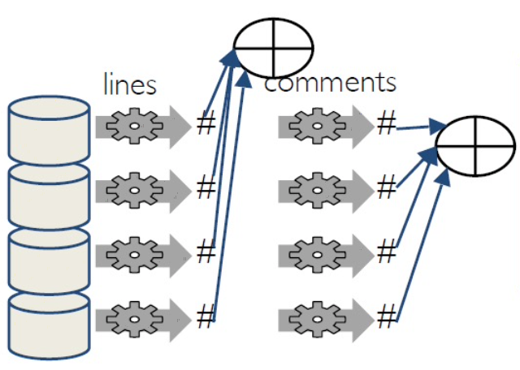
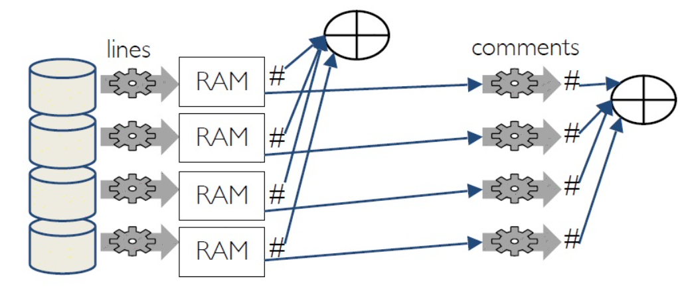

# pyspark-note

- [pyspark-note](#pyspark-note)
- [Concept](#concept)
  - [Where code runs](#where-code-runs)
- [RDD Basic operation](#rdd-basic-operation)
  - [Transformations](#transformations)
    - [`.map()` v.s. `.mapPartitions()` v.s. `.mapPartitionsWithIndex()`](#map-vs-mappartitions-vs-mappartitionswithindex)
      - [1. `.map()`](#1-map)
      - [2. `.mapPartitions()`](#2-mappartitions)
      - [3. `.mapPartitionsWithIndex()`](#3-mappartitionswithindex)
    - [`.map()` v.s. `.flatmap()`](#map-vs-flatmap)
    - [`.foreach()` v.s. `.map()`](#foreach-vs-map)
  - [Actions](#actions)
    - [`sc.parallelize()`](#scparallelize)
    - [`.count()`](#count)
    - [`.collect()`](#collect)
    - [`.glom().collect()`](#glomcollect)
    - [`.getNumPartitions()`](#getnumpartitions)
    - [`.foreach()`](#foreach)
      - [`.map()` v.s. `.foreach()`](#map-vs-foreach)
    - [`.reduce()`](#reduce)
  - [Spark recomputes transformations](#spark-recomputes-transformations)
    - [`.cache()`/`.persist()`](#cachepersist)
  - [RDD - Closure](#rdd---closure)
    - [Closure example](#closure-example)
      - [Incorrect way - `global` variable as counter](#incorrect-way---global-variable-as-counter)
      - [Correct way (1) - `rdd.sum()`](#correct-way-1---rddsum)
      - [Correct way (2) - `.accumulator()`](#correct-way-2---accumulator)
      - [Note](#note)
    - [Accumulator](#accumulator)
- [Deal with `JSON` data](#deal-with-json-data)
  - [[1] Load `.json`/`.json.gz` files to pySpark dataframe](#1-load-jsonjsongz-files-to-pyspark-dataframe)
  - [[2] Load JSON from String / `.txt` files to pySpark dataframe](#2-load-json-from-string--txt-files-to-pyspark-dataframe)
    - [Read json from text files](#read-json-from-text-files)
    - [[a] WITHOUT schema definition](#a-without-schema-definition)
    - [[b] WITH schema definition](#b-with-schema-definition)
  - [Parse JSON from RESTful API](#parse-json-from-restful-api)
  - [[NOT GOOD] ~~Read `JSON` string to pySpark dataframe~~](#not-good-read-json-string-to-pyspark-dataframe)
    - [Read `JSON` to spark Dataframe first](#read-json-to-spark-dataframe-first)
    - [Details](#details)
- [Spark Dataframe](#spark-dataframe)
  - [Create sparkdf by reading `.csv`](#create-sparkdf-by-reading-csv)
  - [`.printSchema()` in df](#printschema-in-df)
  - [`.groupBy().count()`](#groupbycount)
  - [`groupBy().agg()`](#groupbyagg)
  - [`df.createOrReplaceTempView("sql_table")`, allows to run SQL queries once register `df` as temporary tables](#dfcreateorreplacetempviewsql_table-allows-to-run-sql-queries-once-register-df-as-temporary-tables)
  - [`.join()`/`spark.sql()` dataframes](#joinsparksql-dataframes)
    - [`.join()`](#join)
    - [`spark.sql()` + `df.createOrReplaceTempView("sql_table")`](#sparksql--dfcreateorreplacetempviewsql_table)
  - [`df1.union(df2)` concat 2 dataframes](#df1uniondf2-concat-2-dataframes)
  - [UDF `df.withColumn`, user defined function](#udf-dfwithcolumn-user-defined-function)
- [Graph, edge, vertice, Graphframe](#graph-edge-vertice-graphframe)
  - [`GraphFrame(v, e)`, Create GraphFrame](#graphframev-e-create-graphframe)
  - [Explore `GraphFrame`](#explore-graphframe)
  - [Filter, `g.filterVerices()` `g.filterEdges()`](#filter-gfilterverices-gfilteredges)
  - [`.find("(a)-[e]->(b)")`, Motif finding](#finda-e-b-motif-finding)
  - [Subgraphs](#subgraphs)
- [spark-install-macos](#spark-install-macos)
  - [How to start Jupyter Notebook with Spark + GraphFrames](#how-to-start-jupyter-notebook-with-spark--graphframes)
    - [Start it locally](#start-it-locally)
    - [Start in Google Colab](#start-in-google-colab)
    - [Use MongoDB in Spark](#use-mongodb-in-spark)
  - [Test Spark in Jupyter Notebook](#test-spark-in-jupyter-notebook)
- [Reference](#reference)


# Concept

The records/items/elemets are stored in RDD(s).

Each RDD composists of `Partitions`; each `Partition` contains equal number of `items`/`elements`.


## Where code runs


Source: https://spark.apache.org/docs/latest/cluster-overview.html

Most Python code runs in driver (in our local PC), except for code passed to RDD transformations. 
* Transformations run at executors (in workers), 
* actions run at executors and driver.

# RDD Basic operation

RDD Programming Guide

==> https://spark.apache.org/docs/latest/rdd-programming-guide.html

## Transformations

### `.map()` v.s. `.mapPartitions()` v.s. `.mapPartitionsWithIndex()`

Spark的map，mapPartitions，mapPartitionsWithIndex詳解

==> https://blog.csdn.net/QQ1131221088/article/details/104051087

---

#### 1. `.map()`

Return a new distributed dataset formed by passing each element of the source through a function func.

```python
rdd_2 = sc.parallelize(range(10), 4)

new_rdd_2 = rdd_2.map(lambda x: str(x))
print('> .map() =\n', new_rdd_2.glom().collect())
print()

#################################################
from pyspark import TaskContext

result = rdd_2.map(lambda x :x+TaskContext().partitionId())
print('> Original RDD, rdd_2.glom().collect() =\n', rdd_2.glom().collect())
print()
print('> .map() with TaskContext().partitionId() =\n', result.glom().collect())
```

Output:

```shell
> .map() =
 [['0', '1'], ['2', '3', '4'], ['5', '6'], ['7', '8', '9']]

> Original RDD, rdd_2.glom().collect() =
 [[0, 1], [2, 3, 4], [5, 6], [7, 8, 9]]

> .map() with TaskContext().partitionId() =
 [[0, 1], [3, 4, 5], [7, 8], [10, 11, 12]]
```

#### 2. `.mapPartitions()`

Similar to `.map()`, but runs separately on each partition (block) of the RDD, so func must be of type `Iterator<T> => Iterator<U>` when running on an RDD of type T.

==> `Divide-and-Conquer` algorithm => master node `divides` the RDD into partitions, and distributes the partitions to workers, workers apply the same function to its partition. Then master node gets back (i.e. `conquer`) the processed resuts from all workers.

(1)
```python 
rdd_2 = sc.parallelize([1,2,3,4,5,'a','b','c','d','e'], 4)

def func(itemsIteratorInPartition):
    # apply this `func` to each partition (=the whole partition) of the RDD
    yield str(itemsIteratorInPartition)
    
rdd_func = rdd_2.mapPartitions(func)
print('rdd_2.mapPartitions(func) =\n', rdd_func.glom().collect())
print()
```

Output:
```shell
rdd_2.mapPartitions(func) =
 [['<itertools.chain object at 0x7ff8094580d0>'], ['<itertools.chain object at 0x7ff8094580d0>'], ['<itertools.chain object at 0x7ff8094580d0>'], ['<itertools.chain object at 0x7ff8094580d0>']]
```

(2)
```python
def func_2(itemsIteratorInPartition):
    # you loop through each item in each partition of the RDD
    # = just apply this `func_2` to each item in each partition
    for item in itemsIteratorInPartition: 
        yield str(item)

rdd_func_2 = rdd_2.mapPartitions(func_2)
print('rdd_2.mapPartitions(func_2) =\n', rdd_func_2.glom().collect())
```

Output:
```shell
rdd_2.mapPartitions(func_2) =
 [['1', '2'], ['3', '4'], ['5', 'a'], ['b', 'c', 'd', 'e']]
```

#### 3. `.mapPartitionsWithIndex()`

Similar to `mapPartitions`, but also provides func with an integer value representing the index of the partition, so func must be of type `(Int, Iterator<T>) => Iterator<U>` when running on an RDD of type T.

By using mapParitionsWithIndex you could output new elements which have their partition in it, then when you reduce you will know which partition you are handling the elements from. 

==> https://stackoverflow.com/questions/31281225/find-out-the-partition-no-id

```python
rdd_3 = sc.parallelize(range(10), 4)

# mapPartitionsWithIndex
def func(partitionIndex, itemsIteratorInPartition): 
    # apply this `func` to each partition (=the whole partition) of the RDD
    yield (partitionIndex, sum(itemsIteratorInPartition))
new_rdd_3 = rdd_3.mapPartitionsWithIndex(func)

# glom() flattens elements on the same partition
print('> rdd_3.glom().collect() =', rdd_3.glom().collect())
print('> new_rdd_3.glom().collect() =', new_rdd_3.glom().collect())


################################################################################

def func_2(partitionIndex, itemsIteratorInPartition):
    # you loop through each item in each partition of the RDD
    # = just apply this `func_2` to each item in each partition
    for item in itemsIteratorInPartition: 
        yield str(item+partitionIndex)
new_2_rdd_3 = rdd_3.mapPartitionsWithIndex(func_2)

# glom() flattens elements on the same partition
print()
print('>> new_2_rdd_3.glom().collect() =', new_2_rdd_3.glom().collect())
```

Output:

```shell
> rdd_3.glom().collect() = [[0, 1], [2, 3, 4], [5, 6], [7, 8, 9]]
> new_rdd_3.glom().collect() = [[(0, 1)], [(1, 9)], [(2, 11)], [(3, 24)]]

>> new_2_rdd_3.glom().collect() = [['0', '1'], ['3', '4', '5'], ['7', '8'], ['10', '11', '12']]
```

---

### `.map()` v.s. `.flatmap()`

```python
print(sc.version, '\n')

py_list = [str(x) for x in range(5)]
rdd = sc.parallelize(py_list)

# map
new_rdd = rdd.map(lambda item: item+'xx')
print('.map() =\n', new_rdd.collect())
print()

# flatmap
# same as .map(), but flatten the results before returns
# i.e. remove all `list of list`/`nested list`
new_rdd = rdd.flatMap(lambda item: item+'xx')
print('.flatmap() =\n', new_rdd.collect())
```

Output:

```shell
3.1.2

.map() =
['0xx', '1xx', '2xx', '3xx', '4xx']

.flatmap() =
['0', 'x', 'x', '1', 'x', 'x', '2', 'x', 'x', '3', 'x', 'x', '4', 'x', 'x']
```

### `.foreach()` v.s. `.map()`

==> See [`.foreach()`](#foreach) / [`.map()` v.s. `.foreach()`](#map-vs-foreach)


## Actions

**Below example shows there are 100 items/elements in this RDD, and this RDD is partitioned into 4 partitions (or items are grouped in 4 partitions).**

### `sc.parallelize()`

Store python list `[0,1,...,99]` as RDD in Spark. This dataset ***is not loaded in memory***. It is merely ***a pointer to the Python `py_list`***.

```python
# Stores python list `[0,1,...,99]` as RDD in Spark
## This dataset is not loaded in memory
## It is merely a pointer to the Python `py_list` 
py_list = range(100)
rdd = sc.parallelize(py_list)
print(rdd)
```

Output:

```shell
PythonRDD[11] at RDD at PythonRDD.scala:53
```

### `.count()`

Returns the number of items in this RDD

```python
#.count()
# Shows the number of items in this RDD
print('rdd.count()=', rdd.count())
```

Output:
```shell
100
```

### `.collect()`

Returns all the items in this RDD as python list

```python
#.collect()
# Returns all the items in this RDD as python list
print('rdd.collect()=', rdd.collect())
```

Output:
```shell
[0, 1, 2, 3, 4, 5, 6, 7, 8, 9, 10, 11, 12, 13, 14, 15, 16, 17, 18, 19, 20, 21, 22, 23, 24, 25, 26, 27, 28, 29, 30, 31, 32, 33, 34, 35, 36, 37, 38, 39, 40, 41, 42, 43, 44, 45, 46, 47, 48, 49, 50, 51, 52, 53, 54, 55, 56, 57, 58, 59, 60, 61, 62, 63, 64, 65, 66, 67, 68, 69, 70, 71, 72, 73, 74, 75, 76, 77, 78, 79, 80, 81, 82, 83, 84, 85, 86, 87, 88, 89, 90, 91, 92, 93, 94, 95, 96, 97, 98, 99]
```

### `.glom().collect()`

Returns the content of each partitions as `nested list` / `list of list`

```python
# Returns the content of each partitions as `nested list` / `list of list`
rdd.glom().collect()
```

Output:

```shell
[
 [0, 1, 2, 3, 4, 5, 6, 7, 8, 9, 10, 11, 12, 13, 14, 15, 16, 17, 18, 19, 20, 21, 22, 23, 24], 
 [25, 26, 27, 28, 29, 30, 31, 32, 33, 34, 35, 36, 37, 38, 39, 40, 41, 42, 43, 44, 45, 46, 47, 48, 49], 
 [50, 51, 52, 53, 54, 55, 56, 57, 58, 59, 60, 61, 62, 63, 64, 65, 66, 67, 68, 69, 70, 71, 72, 73, 74], 
 [75, 76, 77, 78, 79, 80, 81, 82, 83, 84, 85, 86, 87, 88, 89, 90, 91, 92, 93, 94, 95, 96, 97, 98, 99]
]
```

### `.getNumPartitions()`

Returns number of partitions in this RDD

```python
#.getNumPartitions()
# Gets number of partitions in this RDD
print('rdd.getNumPartitions()=', rdd.getNumPartitions())
```

Output:
```shell
4
```

### `.foreach()`

Just executes inside function for each data element in the **RDD**, but return ***NOTHING***. 

#### `.map()` v.s. `.foreach()`

Short answer
* `.map()`: 
  1. is for transforming one RDD into another, then return the transformed.
  2. Return a new RDD by applying a function to each element of this RDD.
* `.foreach()`: is for applying an operation/function on all elements of this RDD.

    Note: RDD = 1 collection of elements

==> [is-there-a-difference-between-foreach-and-map](https://stackoverflow.com/questions/354909/is-there-a-difference-between-foreach-and-map)

Long answer:

The important difference between them is that `map` accumulates all of the results into a collection, whereas `foreach` returns nothing. `map` is usually used when you want to transform a collection of elements with a function, whereas `foreach` simply executes an action for each element.

* In short, `foreach` is for applying an operation on each element of a collection of elements, whereas `map` is for transforming one collection into another.

* `foreach` works with a single collection of elements. This is the input collection.

* `map` works with two collections of elements: the input collection and the output collection.

### `.reduce()`

```python
rdd = sc.parallelize([('a',7),('a',2),('b',2)])
rdd.reduce(lambda a, b: a + b) #Merge the rdd values
```
```
('a',7,'a',2,'b',2)
```


## Spark recomputes transformations

Transformed RDD is thrown away from memory after execution. If afterward transformations/actions need it, PySpark recompiles it.

 

Image. RDD Without vs With `.cache()` / `.persist()`

P.S. Solution: 
[`.cache()`/`.persist()`](#cachepersist) the transformed RDD

```python
A = sc.parallelize(range(1, 1000)) 
t = 100
B = A.filter(lambda x: x*x < t)
print('B.collect()=', B.collect())  # B.collect()= [1, 2, 3, 4, 5, 6, 7, 8, 9]
## Here: B finishes execution and is thrown away from memory

t = 200
C = B.filter(lambda x: x*x < t) # C needs B again, so recomputes B, but t=200 not =100
                                # So, 
                                # B = A.filter(lambda x: x*x < 200)
                                # C = B.filter(lambda x: x*x < 200)
print('C.collect()=', C.collect())  # C.collect()= [1, 2, 3, 4, 5, 6, 7, 8, 9, 10, 11, 12, 13, 14]
print('C.count()=', C.count())      # C.count()= 14
```

### `.cache()`/`.persist()`
```python
A = sc.parallelize(range(1, 1000)) 
t = 100
B = A.filter(lambda x: x*x < t)
print('B.collect()=', B.collect())  # B.collect()= [1, 2, 3, 4, 5, 6, 7, 8, 9]

# save this RDD in memory/disk
B.cache()
# B.persist()

## Here: B is in memory

t = 200
C = B.filter(lambda x: x*x < t) # C needs B again, memory stores B, NO need to recompute B
                                # So, 
                                # B = previous B
                                # C = B.filter(lambda x: x*x < 200)
print('C.collect()=', C.collect())  # C.collect()= [1, 2, 3, 4, 5, 6, 7, 8, 9]
print('C.count()=', C.count())      # C.count()= 9
```


## RDD - Closure

https://mycupoftea00.medium.com/understanding-closure-in-spark-af6f280eebf9

https://spark.apache.org/docs/latest/rdd-programming-guide.html#understanding-closures-

### Closure example

#### Incorrect way - `global` variable as counter

Q: Why printed counter is 0?

Ans: Because 
1. each executor (i.e. worker node) just applies `increment_counter()` func on its own copy of counter. 
2. Also, `.foreach()` returns nothing

```python
counter = 0
rdd = sc.parallelize(range(10))
print('rdd.collect() =', rdd.collect())

# Wrong: Don't do this!!
def increment_counter(x):
    global counter
    counter += x

rdd.foreach(increment_counter)
print('counter =', counter) # just print out `counter` from your driver program, not from Spark
```

Output:
```
rdd.collect() = [0, 1, 2, 3, 4, 5, 6, 7, 8, 9]
counter = 0
```

#### Correct way (1) - `rdd.sum()`

Correct way to do the above operation:
1. The `.sum()` action is executed in Spark executor(s)
2. `.sum()` returns the sum value

```python
print('rdd.sum() =', rdd.sum())
```

Output:
```
rdd.sum() = 45
```

#### Correct way (2) - `.accumulator()`

Use `.accumulator()` can also solve the issue.

```python
rdd = sc.parallelize(range(10))
accum = sc.accumulator(0)

def g(x):
    global accum
    accum += x

a = rdd.foreach(g)

print(accum.value)
```

```
45
```

#### Note

Update in transformations may be applied more than once if tasks or job stages are re-executed.

```python
rdd = sc.parallelize(range(10))
accum = sc.accumulator(0)

def g(x):
    global accum
    accum += x
    return x * x

a = rdd.map(g)
print(type(accum))
print(accum.value) # 0, because no action presents, `accum` is not immediately computed (= laziness/lazy execution)
# print(a.reduce(lambda x, y: x+y))
a.cache()
tmp = a.count()
print(accum.value) # 45
print(rdd.reduce(lambda x, y: x+y)) # 45

tmp = a.count()
print(accum.value) # 45
print(rdd.reduce(lambda x, y: x+y)) # 45
```

Output:
```
<class 'pyspark.accumulators.Accumulator'>
0   #why it is 0? because of "lazy execution", if no actions present, "accum" is not compiled immediately
45
45
45
45
```

### Accumulator

https://spark.apache.org/docs/latest/rdd-programming-guide.html#accumulators

Note from lecture note: `Suggestion: Avoid using accumulators whenever possible. Use reduce() instead.`

# Deal with `JSON` data

** Most useful ==> https://zhuanlan.zhihu.com/p/267353998

## [1] Load `.json`/`.json.gz` files to pySpark dataframe

**i.e. whole record is present in single line**

Example, a `.json` / `.json.gz`,

1. `jsonFile1.json` (2 records exist)
```json
[{"RecordNumber": 2, "Zipcode": 99999, "ZipCodeType": "STANDARD", "City": "99 PASEO COSTA DEL SUR", "State": "PR"},{"RecordNumber": 10, "Zipcode": 999999999, "ZipCodeType": "STANDARD", "City": "9 BDA SAN LUIS", "State": "PR"}]
```

2. `jsonFile2.json` (2 records exist)
```json
[{"RecordNumber": 99999, "Zipcode": 704, "ZipCodeType": "STANDARD", "City": "xxx PASEO COSTA DEL SUR", "State": "PR"},{"RecordNumber": 999999, "Zipcode": 709, "ZipCodeType": "STANDARD", "City": "xxxx BDA SAN LUIS", "State": "PR"}]
```

Code:
```python
# use `multiline = true` to read multi line JSON file
jsonFiles = ['jsonFile1','jsonFile2']
jsonFiles = [f+'.json' for f in jsonFiles]
print(jsonFiles)
df = spark.read.option('multiline', 'true').json('jsonFile*.json')
df.cache()

df.printSchema()
df.toPandas()
```

Output
```shell
['jsonFile1.json', 'jsonFile2.json']
root
 |-- City: string (nullable = true)
 |-- RecordNumber: long (nullable = true)
 |-- State: string (nullable = true)
 |-- ZipCodeType: string (nullable = true)
 |-- Zipcode: long (nullable = true)

+--------------------+------------+-----+-----------+---------+
|                City|RecordNumber|State|ZipCodeType|  Zipcode|
+--------------------+------------+-----+-----------+---------+
|xxx PASEO COSTA D...|       99999|   PR|   STANDARD|      704|
|   xxxx BDA SAN LUIS|      999999|   PR|   STANDARD|      709|
|99 PASEO COSTA DE...|           2|   PR|   STANDARD|    99999|
|      9 BDA SAN LUIS|          10|   PR|   STANDARD|999999999|
+--------------------+------------+-----+-----------+---------+
```

## [2] Load JSON from String / `.txt` files to pySpark dataframe

https://sparkbyexamples.com/pyspark/pyspark-parse-json-from-string-column-text-file/

`file1.txt`
```txt
{"Zipcode":703,"ZipCodeType":"STANDARD","City":"PARC PARQUE","State":"PR"}
{"Zipcode":704,"ZipCodeType":"STANDARD","City":"PASEO COSTA DEL SUR","State":"PR"}
```

`file2.txt`
```txt
{"Zipcode":299999,"ZipCodeType":"292999STANDARD","City":"PARC PARQUE","State":"PR"}
{"Zipcode":2999,"ZipCodeType":"9999999STANDARD","City":"PASEO COSTA DEL SUR","State":"PR"}
```

### Read json from text files
    ```python
    # (1) read json from text file
    dfFromTxt=spark.read.text("file*.txt")

    dfFromTxt.printSchema()
    dfFromTxt.show(truncate=False)
    ```

    Output
    ```shell
    root
      |-- value: string (nullable = true)

    +------------------------------------------------------------------------------------------+
    |value                                                                                     |
    +------------------------------------------------------------------------------------------+
    |{"Zipcode":299999,"ZipCodeType":"292999STANDARD","City":"PARC PARQUE","State":"PR"}       |
    |{"Zipcode":2999,"ZipCodeType":"9999999STANDARD","City":"PASEO COSTA DEL SUR","State":"PR"}|
    |{"Zipcode":703,"ZipCodeType":"STANDARD","City":"PARC PARQUE","State":"PR"}                |
    |{"Zipcode":704,"ZipCodeType":"STANDARD","City":"PASEO COSTA DEL SUR","State":"PR"}        |
    +------------------------------------------------------------------------------------------+
    ```

### [a] WITHOUT schema definition

    ```python
      # Originally
      # json_df = spark.read.json(dfFromTxt.rdd.map(lambda row: row.value))

      # Explain
      list_of_string = dfFromTxt.rdd.map(lambda row: row.value)
      display(list_of_string.collect())

      json_df = spark.read.json(list_of_string)
      json_df.printSchema()
      json_df.show()
    ```

    Output
    ```shell
      ['{"Zipcode":299999,"ZipCodeType":"292999STANDARD","City":"PARC PARQUE","State":"PR"}',
      '{"Zipcode":2999,"ZipCodeType":"9999999STANDARD","City":"PASEO COSTA DEL SUR","State":"PR"}',
      '{"Zipcode":703,"ZipCodeType":"STANDARD","City":"PARC PARQUE","State":"PR"}',
      '{"Zipcode":704,"ZipCodeType":"STANDARD","City":"PASEO COSTA DEL SUR","State":"PR"}']
      root
        |-- City: string (nullable = true)
        |-- State: string (nullable = true)
        |-- ZipCodeType: string (nullable = true)
        |-- Zipcode: long (nullable = true)

      +-------------------+-----+---------------+-------+
      |               City|State|    ZipCodeType|Zipcode|
      +-------------------+-----+---------------+-------+
      |        PARC PARQUE|   PR| 292999STANDARD| 299999|
      |PASEO COSTA DEL SUR|   PR|9999999STANDARD|   2999|
      |        PARC PARQUE|   PR|       STANDARD|    703|
      |PASEO COSTA DEL SUR|   PR|       STANDARD|    704|
      +-------------------+-----+---------------+-------+
    ```

### [b] WITH schema definition

1.  Define schema

    ```python
    # (2) Create Schema of the JSON column
    from pyspark.sql.types import StructType,StructField, StringType
    schema = StructType([ 
        StructField("Zipcode",StringType(),True), 
        StructField("ZipCodeType",StringType(),True), 
        StructField("City",StringType(),True), 
        StructField("State", StringType(), True)
      ])
    schema
    ```

    Output
    ```shell
    StructType(List(StructField(Zipcode,StringType,true),StructField(ZipCodeType,StringType,true),StructField(City,StringType,true),StructField(State,StringType,true)))
    ```

2.  Convert json column to multiple columns

    ```python
    # (3) Convert json column to multiple columns
    from pyspark.sql.functions import col,from_json
    dfJSON = dfFromTxt.withColumn("jsonData",from_json(col("value"),schema)) \
                      .select("jsonData.*")
    dfJSON.printSchema()
    dfJSON.show(truncate=False)
    ```

    Output
    ```shell
    root
      |-- Zipcode: string (nullable = true)
      |-- ZipCodeType: string (nullable = true)
      |-- City: string (nullable = true)
      |-- State: string (nullable = true)

    +-------+---------------+-------------------+-----+
    |Zipcode|ZipCodeType    |City               |State|
    +-------+---------------+-------------------+-----+
    |299999 |292999STANDARD |PARC PARQUE        |PR   |
    |2999   |9999999STANDARD|PASEO COSTA DEL SUR|PR   |
    |703    |STANDARD       |PARC PARQUE        |PR   |
    |704    |STANDARD       |PASEO COSTA DEL SUR|PR   |
    +-------+---------------+-------------------+-----+
    ```

## Parse JSON from RESTful API

1.  Call API
    ```python
    url = f'https://www.als.ogcio.gov.hk/lookup'
    headers = {'Accept': 'application/json',
                'User-Agent': 'Mozilla/5.0 (X11; Linux x86_64) AppleWebKit/537.36 (KHTML, like Gecko) Chrome/56.0.2924.87 Safari/537.36'}
    params = {'q': requestAddress, 
              'n': 3
              }
    # sending get request and saving the response as response object
    response = requests.get(url=url, headers=headers, params=params)

    _json = response.json()
    _json
    ```

    Output (`list of dict` in py)
    ```python
      {'RequestAddress': {'AddressLine': ['何文田邨']},
       'SuggestedAddress': [{'Address': {'PremisesAddress': {'ChiPremisesAddress': {'BuildingName': '何文田政府合署',
            'ChiDistrict': {'DcDistrict': '九龍城區'},
            'ChiEstate': {'EstateName': '何文田邨'},
            'ChiStreet': {'BuildingNoFrom': '88', 'StreetName': '忠孝街'},
            'Region': '九龍'},
          'EngPremisesAddress': {'BuildingName': 'HO MAN TIN GOVERNMENT OFFICES',
            'EngDistrict': {'DcDistrict': 'KOWLOON CITY DISTRICT'},
            'EngEstate': {'EstateName': 'HO MAN TIN ESTATE'},
            'EngStreet': {'BuildingNoFrom': '88', 'StreetName': 'CHUNG HAU STREET'},
            'Region': 'KLN'},
          'GeoAddress': '3658519520T20050430',
          'GeospatialInformation': {'Easting': '836597',
            'Latitude': '22.31468',
            'Longitude': '114.18007',
            'Northing': '819521'}}},
        'ValidationInformation': {'Score': 75.0}},
        {'Address': {'PremisesAddress': {'ChiPremisesAddress': {'BuildingName': '何文田廣場',
            'ChiDistrict': {'DcDistrict': '九龍城區'},
            'ChiEstate': {'EstateName': '何文田邨'},
            'ChiStreet': {'BuildingNoFrom': '80', 'StreetName': '佛光街'},
            'Region': '九龍'},
          'EngPremisesAddress': {'BuildingName': 'HOMANTIN PLAZA',
            'EngDistrict': {'DcDistrict': 'KOWLOON CITY DISTRICT'},
            'EngEstate': {'EstateName': 'HO MAN TIN ESTATE'},
            'EngStreet': {'BuildingNoFrom': '80', 'StreetName': 'FAT KWONG STREET'},
            'Region': 'KLN'},
          'GeoAddress': '3677919691P20060311',
          'GeospatialInformation': {'Easting': '836780',
            'Latitude': '22.31622',
            'Longitude': '114.18184',
            'Northing': '819692'}}},
        'ValidationInformation': {'Score': 75.0}},
        {'Address': {'PremisesAddress': {'ChiPremisesAddress': {'BuildingName': '靜文樓',
            'ChiDistrict': {'DcDistrict': '九龍城區'},
            'ChiEstate': {'EstateName': '何文田邨'},
            'ChiStreet': {'BuildingNoFrom': '68', 'StreetName': '佛光街'},
            'Region': '九龍'},
          'EngPremisesAddress': {'BuildingName': 'CHING MAN HOUSE',
            'EngDistrict': {'DcDistrict': 'KOWLOON CITY DISTRICT'},
            'EngEstate': {'EstateName': 'HO MAN TIN ESTATE'},
            'EngStreet': {'BuildingNoFrom': '68', 'StreetName': 'FAT KWONG STREET'},
            'Region': 'KLN'},
          'GeoAddress': '3683619541T20050430',
          'GeospatialInformation': {'Easting': '836839',
            'Latitude': '22.31497',
            'Longitude': '114.18242',
            'Northing': '819553'}}},
        'ValidationInformation': {'Score': 62.95}}
        ]
      }
    ```

2.  Convert `list of dict` to PySpark RDD to Dataframe

    ```python
      rdd = sc.parallelize([_json])

      readComplexJSONDF = spark.read.option("multiLine","true").json(rdd)
      readComplexJSONDF.show(truncate=False)
      readComplexJSONDF.printSchema()
    ```

    Output
    ```shell
      +--------------+-----------------------------------------------------------------------------------------------------------------------------------------------------------------------------------------------------------------------------------------------------------------------------------------------------------------------------------------------------------------------------------------------------------------------------------------------------------------------------------------------------------------------------------------------------------------------------------------------------------------------------------------------------------------------------------------------------------------------------------------+
      |RequestAddress|SuggestedAddress                                                                                                                                                                                                                                                                                                                                                                                                                                                                                                                                                                                                                                                                                                                         |
      +--------------+-----------------------------------------------------------------------------------------------------------------------------------------------------------------------------------------------------------------------------------------------------------------------------------------------------------------------------------------------------------------------------------------------------------------------------------------------------------------------------------------------------------------------------------------------------------------------------------------------------------------------------------------------------------------------------------------------------------------------------------------+
      | [[何文田邨]]  |   [[[[[何文田政府合署, [九龍城區], [何文田邨], [88, 忠孝街], 九龍], [HO MAN TIN GOVERNMENT OFFICES, [KOWLOON CITY DISTRICT], [HO MAN TIN ESTATE], [88, CHUNG HAU STREET], KLN], 3658519520T20050430, [836597, 22.31468, 114.18007, 819521]]], [75.0]], [[[[何文田政府合署, [九龍城區], [何文田邨], [68, 佛光街], 九龍], [HO MAN TIN GOVERNMENT OFFICES, [KOWLOON CITY DISTRICT], [HO MAN TIN ESTATE], [68, FAT KWONG STREET], KLN], 3658519520T20050430, [836597, 22.31468, 114.18007, 819521]]], [75.0]], [[[[何文田廣場, [九龍城區], [何文田邨], [80, 佛光街], 九龍], [HOMANTIN PLAZA, [KOWLOON CITY DISTRICT], [HO MAN TIN ESTATE], [80, FAT KWONG STREET], KLN], 3677919691P20060311, [836780, 22.31622, 114.18184, 819692]]], [75.0]]]                 |
      +--------------+-----------------------------------------------------------------------------------------------------------------------------------------------------------------------------------------------------------------------------------------------------------------------------------------------------------------------------------------------------------------------------------------------------------------------------------------------------------------------------------------------------------------------------------------------------------------------------------------------------------------------------------------------------------------------------------------------------------------------------------------+

      root
        |-- RequestAddress: struct (nullable = true)
        |    |-- AddressLine: array (nullable = true)
        |    |    |-- element: string (containsNull = true)
        |-- SuggestedAddress: array (nullable = true)
        |    |-- element: struct (containsNull = true)
        |    |    |-- Address: struct (nullable = true)
        |    |    |    |-- PremisesAddress: struct (nullable = true)
        |    |    |    |    |-- ChiPremisesAddress: struct (nullable = true)
        |    |    |    |    |    |-- BuildingName: string (nullable = true)
        |    |    |    |    |    |-- ChiDistrict: struct (nullable = true)
        |    |    |    |    |    |    |-- DcDistrict: string (nullable = true)
        |    |    |    |    |    |-- ChiEstate: struct (nullable = true)
        |    |    |    |    |    |    |-- EstateName: string (nullable = true)
        |    |    |    |    |    |-- ChiStreet: struct (nullable = true)
        |    |    |    |    |    |    |-- BuildingNoFrom: string (nullable = true)
        |    |    |    |    |    |    |-- StreetName: string (nullable = true)
        |    |    |    |    |    |-- Region: string (nullable = true)
        |    |    |    |    |-- EngPremisesAddress: struct (nullable = true)
        |    |    |    |    |    |-- BuildingName: string (nullable = true)
        |    |    |    |    |    |-- EngDistrict: struct (nullable = true)
        |    |    |    |    |    |    |-- DcDistrict: string (nullable = true)
        |    |    |    |    |    |-- EngEstate: struct (nullable = true)
        |    |    |    |    |    |    |-- EstateName: string (nullable = true)
        |    |    |    |    |    |-- EngStreet: struct (nullable = true)
        |    |    |    |    |    |    |-- BuildingNoFrom: string (nullable = true)
        |    |    |    |    |    |    |-- StreetName: string (nullable = true)
        |    |    |    |    |    |-- Region: string (nullable = true)
        |    |    |    |    |-- GeoAddress: string (nullable = true)
        |    |    |    |    |-- GeospatialInformation: struct (nullable = true)
        |    |    |    |    |    |-- Easting: string (nullable = true)
        |    |    |    |    |    |-- Latitude: string (nullable = true)
        |    |    |    |    |    |-- Longitude: string (nullable = true)
        |    |    |    |    |    |-- Northing: string (nullable = true)
        |    |    |-- ValidationInformation: struct (nullable = true)
        |    |    |    |-- Score: double (nullable = true)
    ```

3.  Explode Array to Structure

    ```python
      # Explode Array to Structure
      explodeArrarDF = readComplexJSONDF.withColumn('Explode_SuggestedAddress', F.explode(F.col('SuggestedAddress'))).drop('SuggestedAddress')
      explodeArrarDF.printSchema()
      explodeArrarDF.show()

      # Read location and name
      dfReadSpecificStructure = explodeArrarDF.select("Explode_SuggestedAddress.Address.PremisesAddress.ChiPremisesAddress.BuildingName",
                                                      "Explode_SuggestedAddress.Address.PremisesAddress.ChiPremisesAddress.ChiDistrict.*",
                                                      "Explode_SuggestedAddress.Address.PremisesAddress.ChiPremisesAddress.ChiEstate.*",
                                                      "Explode_SuggestedAddress.Address.PremisesAddress.ChiPremisesAddress.ChiStreet.*",
                                                      "Explode_SuggestedAddress.Address.PremisesAddress.ChiPremisesAddress.Region",
                                                      "Explode_SuggestedAddress.Address.PremisesAddress.GeospatialInformation.*",
                                                      "Explode_SuggestedAddress.ValidationInformation.*") 
      dfReadSpecificStructure.show(truncate=False)
    ```

    Output
    ```shell
      root
        |-- RequestAddress: struct (nullable = true)
        |    |-- AddressLine: array (nullable = true)
        |    |    |-- element: string (containsNull = true)
        |-- Explode_SuggestedAddress: struct (nullable = true)
        |    |-- Address: struct (nullable = true)
        |    |    |-- PremisesAddress: struct (nullable = true)
        |    |    |    |-- ChiPremisesAddress: struct (nullable = true)
        |    |    |    |    |-- BuildingName: string (nullable = true)
        |    |    |    |    |-- ChiDistrict: struct (nullable = true)
        |    |    |    |    |    |-- DcDistrict: string (nullable = true)
        |    |    |    |    |-- ChiEstate: struct (nullable = true)
        |    |    |    |    |    |-- EstateName: string (nullable = true)
        |    |    |    |    |-- ChiStreet: struct (nullable = true)
        |    |    |    |    |    |-- BuildingNoFrom: string (nullable = true)
        |    |    |    |    |    |-- StreetName: string (nullable = true)
        |    |    |    |    |-- Region: string (nullable = true)
        |    |    |    |-- EngPremisesAddress: struct (nullable = true)
        |    |    |    |    |-- BuildingName: string (nullable = true)
        |    |    |    |    |-- EngDistrict: struct (nullable = true)
        |    |    |    |    |    |-- DcDistrict: string (nullable = true)
        |    |    |    |    |-- EngEstate: struct (nullable = true)
        |    |    |    |    |    |-- EstateName: string (nullable = true)
        |    |    |    |    |-- EngStreet: struct (nullable = true)
        |    |    |    |    |    |-- BuildingNoFrom: string (nullable = true)
        |    |    |    |    |    |-- StreetName: string (nullable = true)
        |    |    |    |    |-- Region: string (nullable = true)
        |    |    |    |-- GeoAddress: string (nullable = true)
        |    |    |    |-- GeospatialInformation: struct (nullable = true)
        |    |    |    |    |-- Easting: string (nullable = true)
        |    |    |    |    |-- Latitude: string (nullable = true)
        |    |    |    |    |-- Longitude: string (nullable = true)
        |    |    |    |    |-- Northing: string (nullable = true)
        |    |-- ValidationInformation: struct (nullable = true)
        |    |    |-- Score: double (nullable = true)

      +--------------+--------------------------------------------------------------------------------------------------------------------------------------------------------------------------------------------------------------------------------------------------+
      |RequestAddress|  Explode_SuggestedAddress                                                                                                                                                                                                                        |
      +--------------+--------------------------------------------------------------------------------------------------------------------------------------------------------------------------------------------------------------------------------------------------+
      |[[何文田邨]]   |  [[[[何文田政府合署, [九龍城區], [何文田邨], [88, 忠孝街], 九龍], [HO MAN TIN GOVERNMENT OFFICES, [KOWLOON CITY DISTRICT], [HO MAN TIN ESTATE], [88, CHUNG HAU STREET], KLN], 3658519520T20050430, [836597, 22.31468, 114.18007, 819521]]], [75.0]]     |
      |[[何文田邨]]   |  [[[[何文田政府合署, [九龍城區], [何文田邨], [68, 佛光街], 九龍], [HO MAN TIN GOVERNMENT OFFICES, [KOWLOON CITY DISTRICT], [HO MAN TIN ESTATE], [68, FAT KWONG STREET], KLN], 3658519520T20050430, [836597, 22.31468, 114.18007, 819521]]], [75.0]]     |
      |[[何文田邨]]   |  [[[[何文田廣場, [九龍城區], [何文田邨], [80, 佛光街], 九龍], [HOMANTIN PLAZA, [KOWLOON CITY DISTRICT], [HO MAN TIN ESTATE], [80, FAT KWONG STREET], KLN], 3677919691P20060311, [836780, 22.31622, 114.18184, 819692]]], [75.0]]                       |
      +--------------+--------------------------------------------------------------------------------------------------------------------------------------------------------------------------------------------------------------------------------------------------+

      +--------------+----------+----------+--------------+----------+------+-------+--------+---------+--------+-----+
      |BuildingName  |DcDistrict|EstateName|BuildingNoFrom|StreetName|Region|Easting|Latitude|Longitude|Northing|Score|
      +--------------+----------+----------+--------------+----------+------+-------+--------+---------+--------+-----+
      |何文田政府合署   |九龍城區   |何文田邨    |88           |忠孝街     |九龍   |836597 |22.31468|114.18007|819521  |75.0 |
      |何文田政府合署   |九龍城區   |何文田邨    |68           |佛光街     |九龍   |836597 |22.31468|114.18007|819521  |75.0 |
      |何文田廣場      |九龍城區   |何文田邨    |80           |佛光街     |九龍   |836780 |22.31622|114.18184|819692  |75.0 |
      +--------------+----------+----------+--------------+----------+------+-------+--------+---------+--------+-----+
    ```

## [NOT GOOD] ~~Read `JSON` string to pySpark dataframe~~

### Read `JSON` to spark Dataframe first

**https://sparkbyexamples.com/pyspark/pyspark-maptype-dict-examples/**

Steps,
1. JSON from API 
2. get `list of dict` 
3. pySpark dataframe with `map type` 
4. access PySpark MapType Elements

### Details

1. 
    ```python
    # The nested json / list of dictionary
    data_json = [
        ('James', {'hair': 'black', 'eye': 'brown'}),
        ('Michael', {'hair': 'brown', 'eye': None}),
        ('Robert', {'hair': 'red', 'eye': 'black'}),
        ('Washington', {'hair': 'grey', 'eye': 'grey'}),
        ('Jefferson', {'hair': 'brown', 'eye': ''})
    ]
    df = spark.createDataFrame(data=data_json)
    df.printSchema()
    ```

    Output:

    ```
    root
    |-- Name: string (nullable = true)
    |-- properties: map (nullable = true)
    |    |-- key: string
    |    |-- value: string (valueContainsNull = true)

    +----------+-----------------------------+
    |Name      |properties                   |
    +----------+-----------------------------+
    |James     |[eye -> brown, hair -> black]|
    |Michael   |[eye ->, hair -> brown]      |
    |Robert    |[eye -> black, hair -> red]  |
    |Washington|[eye -> grey, hair -> grey]  |
    |Jefferson |[eye -> , hair -> brown]     |
    +----------+-----------------------------+
    ```

2. Access the elements in map datatype

    Method (1):
    ```python
    df3 = df.rdd.map(lambda x: \
                    (x.name, x.properties["hair"], x.properties["eye"])) \
                    .toDF(["name", "hair", "eye"])
    df3.printSchema()
    df3.show()
    ```

    OR

    Method (2):
    ```python
    df.withColumn("hair", df.properties.getItem("hair")) \
        .withColumn("eye", df.properties.getItem("eye")) \
        .drop("properties") \
        .show()

    # same as above
    df.withColumn("hair", df.properties["hair"]) \
        .withColumn("eye", df.properties["eye"]) \
        .drop("properties") \
        .show()
    ```

    Output:
    ```
    root
    |-- name: string (nullable = true)
    |-- hair: string (nullable = true)
    |-- eye: string (nullable = true)

    +----------+-----+-----+
    |      name| hair|  eye|
    +----------+-----+-----+
    |     James|black|brown|
    |   Michael|brown| null|
    |    Robert|  red|black|
    |Washington| grey| grey|
    | Jefferson|brown|     |
    +----------+-----+-----+
    ```

# Spark Dataframe

## Create sparkdf by reading `.csv`

* http://www.cse.ust.hk/msbd5003/data/customer.csv
* http://www.cse.ust.hk/msbd5003/data/orders.csv

`customer.csv`:
```shell
CUSTKEY,NAME,ADDRESS,NATIONKEY,PHONE,ACCTBAL,MKTSEGMENT,COMMENT
1,Customer#000000001,IVhzIApeRb ot,c,E,15,25-989-741-2988,711.56,BUILDING,to the even, regular platelets. regular, ironic epitaphs nag e,
2,Customer#000000002,XSTf4,NCwDVaWNe6tEgvwfmRchLXak,13,23-768-687-3665,121.65,AUTOMOBILE,l accounts. blithely ironic theodolites integrate boldly: caref,
3,Customer#000000003,MG9kdTD2WBHm,1,11-719-748-3364,7498.12,AUTOMOBILE, deposits eat slyly ironic, even instructions. express foxes detect slyly. blithely even accounts abov,
4,Customer#000000004,XxVSJsLAGtn,4,14-128-190-5944,2866.83,MACHINERY, requests. final, regular ideas sleep final accou,
...
```

`orders.csv`:
```shell
ORDERKEY,CUSTKEY,ORDERSTATUS,TOTALPRICE,ORDERDATE,ORDERPRIORITY,CLERK,SHIPPRIORITY,COMMENT
1,370,O,172799.49,1996-01-02,5-LOW,Clerk#000000951,0,nstructions sleep furiously among ,
2,781,O,38426.09,1996-12-01,1-URGENT,Clerk#000000880,0, foxes. pending accounts at the pending, silent asymptot,
3,1234,F,205654.30,1993-10-14,5-LOW,Clerk#000000955,0,sly final accounts boost. carefully regular ideas cajole carefully. depos,
4,1369,O,56000.91,1995-10-11,5-LOW,Clerk#000000124,0,sits. slyly regular warthogs cajole. regular, regular theodolites acro,
5,445,F,105367.67,1994-07-30,5-LOW,Clerk#000000925,0,quickly. bold deposits sleep slyly. packages use slyly,
...
```

```python
dfCustomer = spark.read.csv('customer.csv', header=True, inferSchema=True)
dfOrders = spark.read.csv('orders.csv', header=True, inferSchema=True)
```

## `.printSchema()` in df

```python
dfCustomer.printSchema()
print(dfCustomer.count())

dfOrders.printSchema()
print(dfOrders.count())
```

Output:
```shell
root
 |-- CUSTKEY: integer (nullable = true)
 |-- NAME: string (nullable = true)
 |-- ADDRESS: string (nullable = true)
 |-- NATIONKEY: string (nullable = true)
 |-- PHONE: string (nullable = true)
 |-- ACCTBAL: string (nullable = true)
 |-- MKTSEGMENT: string (nullable = true)
 |-- COMMENT: string (nullable = true)
1500

root
 |-- ORDERKEY: integer (nullable = true)
 |-- CUSTKEY: integer (nullable = true)
 |-- ORDERSTATUS: string (nullable = true)
 |-- TOTALPRICE: double (nullable = true)
 |-- ORDERDATE: string (nullable = true)
 |-- ORDERPRIORITY: string (nullable = true)
 |-- CLERK: string (nullable = true)
 |-- SHIPPRIORITY: integer (nullable = true)
 |-- COMMENT: string (nullable = true)
 15000
```

## `.groupBy().count()`

Find `count of orders` of each customer `CUSTKEY` has:
```python
dfOrders_groupby = dfOrders.groupBy('CUSTKEY').count()
dfOrders_groupby.toPandas()
```

Output:
```
	CUSTKEY	count
0	463	20
1	1342	20
2	496	18
3	148	15
4	1088	7
...	...	...
995	401	12
996	517	25
997	422	12
998	89	7
999	1138	23
1000 rows × 2 columns
```

## `groupBy().agg()`

[ xxxx ]

## `df.createOrReplaceTempView("sql_table")`, allows to run SQL queries once register `df` as temporary tables

```python
dfOrders_groupby.createOrReplaceTempView("sql_table")

# Can run SQL query on it
df = spark.sql("SELECT customer.CUSTKEY, orders.count FROM customer left outer join orders on customer.CUSTKEY = orders.CUSTKEY")
df.toPandas()
```

Output:
```
    CUSTKEY	count
0	1	9.0
1	2	10.0
2	3	NaN
3	4	31.0
4	5	9.0
...	...	...
1495	1496	9.0
1496	1497	NaN
1497	1498	20.0
1498	1499	21.0
1499	1500	NaN
1500 rows × 2 columns
```

## `.join()`/`spark.sql()` dataframes
### `.join()`
```python
# join 2 df by `CUSTKEY`
joined_df = dfCustomer.join(dfOrders, on='CUSTKEY', how='leftouter')
df2 = joined_df.select('CUSTKEY', 'ORDERKEY').sort(asc('CUSTKEY'),desc('ORDERKEY')) #ascending by 'CUSTKEY', descending by 'ORDERKET'
df2.toPandas() #view
```

`how`: str, optional
    default ``inner``. Must be one of: ``inner``, ``cross``, ``outer``,
    ``full``, ``fullouter``, ``full_outer``, ``left``, ``leftouter``, ``left_outer``,
    ``right``, ``rightouter``, ``right_outer``, ``semi``, ``leftsemi``, ``left_semi``,
    ``anti``, ``leftanti`` and ``left_anti``.

### `spark.sql()` + `df.createOrReplaceTempView("sql_table")`
```python
dfOrders.createOrReplaceTempView("orders")
dfCustomer.createOrReplaceTempView("customer")

# Can run SQL query on it
df2 = spark.sql("SELECT customer.CUSTKEY, orders.ORDERKEY FROM customer left outer join orders on customer.CUSTKEY = orders.CUSTKEY")
df2.toPandas()
```

Output:
```shell
    CUSTKEY	ORDERKEY
0	1	53283.0
1	1	52263.0
2	1	43879.0
3	1	36422.0
4	1	34019.0
...	...	...
15495	1499	7301.0
15496	1499	3523.0
15497	1499	1472.0
15498	1499	1252.0
15499	1500	NaN
15500 rows × 2 columns
```

## `df1.union(df2)` concat 2 dataframes

The dataframes may need to have identical columns, in which case you can use `withColumn()` to create `normal_1` and `normal_2`

```python
df_concat = df_1.union(df_2)
```

## UDF `df.withColumn`, user defined function

[Reference](https://sparkbyexamples.com/pyspark/pyspark-udf-user-defined-function/)

# Graph, edge, vertice, Graphframe

Credit to [link](https://github.com/cenzwong/tech/tree/master/Note/Spark#graphframe)

## `GraphFrame(v, e)`, Create GraphFrame

```python
# Vertics DataFrame
v = spark.createDataFrame([
  ("a", "Alice", 34),
  ("b", "Bob", 36),
  ("c", "Charlie", 37),
  ("d", "David", 29),
  ("e", "Esther", 32),
  ("f", "Fanny", 38),
  ("g", "Gabby", 60)
], ["id", "name", "age"])

# Edges DataFrame
e = spark.createDataFrame([
  ("a", "b", "friend"),
  ("b", "c", "follow"), # b and c follow each other
  ("c", "b", "follow"), #
  ("f", "c", "follow"),
  ("e", "f", "follow"),
  ("e", "d", "friend"),
  ("d", "a", "friend"),
  ("a", "e", "friend"),
  ("g", "e", "follow")
], ["src", "dst", "relationship"])

# Create a GraphFrame
g = GraphFrame(v, e)

g.vertices.show()
g.edges.show()
```

```python
# Vertics DataFrame
v = spark.createDataFrame([
    ("a", "Alice", 34),
    ("b", "Bob", 36),
    ("c", "Charlie", 37),
    ("d", "David", 29),
    ("e", "Esther", 32),
    ("f", "Fanny", 38),
    ("g", "Gabby", 60)
], ["id", "name", "age"])
# Edges DataFrame
e = spark.createDataFrame([
    ("a", "b", "follow"),
    ("c", "a", "friend"),
    ("b", "c", "follow"),
    ("d", "a", "follow"),
    ("f", "c", "follow"),
    ("f", "d", "follow"),
    ("f", "b", "follow"),
    ("c", "d", "follow"),
    ("g", "a", "friend"),
    ("g", "d", "friend"),
    ("g", "c", "friend"),
    ("e", "a", "follow"),
    ("e", "d", "follow")
], ["src", "dst", "relationship"])

# Create a GraphFrame
g = GraphFrame(v, e)
```

## Explore `GraphFrame`

Credit to [link](https://github.com/cenzwong/tech/tree/master/Note/Spark#graphframe)

```python
g.triplets.show() # display all
g.vertices.show() # display vertices
g.edges.show()    # display edges
g.degrees.show()
g.inDegrees.show()
g.outDegrees.show()
```

## Filter, `g.filterVerices()` `g.filterEdges()`

Returns `GraphFrame`, not `DataFrame`.

Credit to [link](https://github.com/cenzwong/tech/tree/master/Note/Spark#graphframe)

```python
g.filterVerices("columnName > 30")
g.filterEdges("columnName = 30")
g.dropIsolatedVertices() #Drop isolated vertices (users) which are not contained in any edges (relationships).
                         #Vertices without incoming / outgoing edges
```

## `.find("(a)-[e]->(b)")`, Motif finding

Find the edges `e` from vertex `a` to vertex `b`.

P.S. `.find()` returns `sparkDF` DataFrame.

Credit to [link](https://github.com/cenzwong/tech/tree/master/Note/Spark#graphframe)

```python
g.find("(a)-[]->(b);(b)-[]->(a)").filter("a.id < b.id") # A and B follow/friend each other; 
                                                        # .filter() out "B follows/friends back A" rows, 
                                                        # just keeps "A follows/friends B" rows
g.find("(a)-[]->(b); !(b)-[]->(a)").filter("a.id < b.id") # jsut A follows B, B not follows A
g.find("!()-[]->(a)") # find vertices without incoming edges
g.find("(a)-[e]->(b)").filter("e.relationship = 'follow'") # find A follows B,
```

## Subgraphs

Credit to `msbd5003`.

```python
# Build subgraph based on conditions, i.e. subgraph contains (v,e)
# Select subgraph of users older than 30, and relationships of type "friend".
# Drop isolated vertices (users) which are not contained in any edges (relationships).
g1 = g.filterVertices("age > 30").filterEdges("relationship = 'friend'")\
      .dropIsolatedVertices()
g1.vertices.show()
g1.edges.show()
```
Output:
```
+---+------+---+
| id|  name|age|
+---+------+---+
|  e|Esther| 32|
|  b|   Bob| 36|
|  a| Alice| 34|
+---+------+---+
+---+---+------------+
|src|dst|relationship|
+---+---+------------+
|  a|  e|      friend|
|  a|  b|      friend|
+---+---+------------+
```


# spark-install-macos

Run the following in macOS terminal,

## How to start Jupyter Notebook with Spark + GraphFrames

### Start it locally

1. Modify the PATH variables,
    ``` shell
    $ nano ~/.bashrc
    ```

2. Add the following lines in `~/.bashrc`, so `spark` and `jupyter notebook` can be launched at the same time.

    ```shell
    # Setting PATH for Spark 3.1.2
    export SPARK_HOME=/usr/local/Cellar/apache-spark/3.1.2/libexec
    export PATH="$SPARK_HOME/bin/:$PATH"
    export PYSPARK_DRIVER_PYTHON="jupyter"
    export PYSPARK_DRIVER_PYTHON_OPTS="notebook"
    ```

    In terminal,
    
    

3. Update $PATH variable,

    ```shell
    $ source ~/.bashrc
    ```

4. Ensure `graphframes-0.8.1-spark3.0-s_2.12.jar` presents in the `/Users/<USER_NAME>/.ivy2/jars` folder:

    

    Start the `pyspark` with `graphframes` in terminal,
    
    ==> Needs 2 flags, `--packages` and `--jars`

    ==> Ensure the `graphframes` package name is same as `graphframes-0.8.1-spark3.0-s_2.12.jar` in folder.
    
    => Deal with error: `java.lang.ClassNotFoundException: org.graphframes.GraphFramePythonAPI`

    => https://blog.csdn.net/qq_42166929/article/details/105983616 
    
    ```shell
    $ pyspark --packages graphframes:graphframes:0.8.1-spark3.0-s_2.12 --jars graphframes-0.8.1-spark3.0-s_2.12.jar
    ```
    
    Terminal output:
    
    

    Jupyter Notebook:

    

### Start in Google Colab

[Still need to investigate]

https://github.com/cenzwong/tech/tree/master/Note/Spark#graphframe

### Use MongoDB in Spark

Terminal:

```shell 
pyspark --packages graphframes:graphframes:0.8.1-spark3.0-s_2.12 --jars graphframes-0.8.1-spark3.0-s_2.12.jar \
        --conf "spark.mongodb.input.uri=mongodb://127.0.0.1/test.application_test?readPreference=primaryPreferred" \
        --conf "spark.mongodb.output.uri=mongodb://127.0.0.1/test.application_test" \
        --packages org.mongodb.spark:mongo-spark-connector_2.12:3.0.1
```

Notebook:

```python
from pymongo import MongoClient 

def _saveDfToMongoDB(sparkDF, mongoCollection):
    sparkDF.cache()
    print(f"Storing {sparkDF.count()} {mongoCollection} to db")

    start = datetime.now()

    sparkDF.write.format("mongo") \
        .mode("append") \
        .option("database", "msbd5003") \
        .option("collection", mongoCollection) \
        .save()

    end = datetime.now()
    spent = (end - start).total_seconds()
    print(f"Stored, time used: {spent} s")

df = spark.read.json("file path")
_saveDfToMongoDB(df, "mongodb collection name")
```

## Test Spark in Jupyter Notebook

Inside Jupyter Notebook:

==> Reference: https://medium.com/@roshinijohri/spark-with-jupyter-notebook-on-macos-2-0-0-and-higher-c61b971b5007


Cell 1:

```python
print(sc.version)
```

Output 1:

```shell
3.1.2
```

OR

```python
from pyspark import SparkContext
from pyspark.sql import SparkSession
from pyspark.sql.functions import *
from graphframes import *

spark = SparkSession.builder.master("local[*]").getOrCreate()
sc = spark.sparkContext

sc
```

Output:

```shell
SparkSession - hive
SparkContext

Spark UI
Version
v3.1.2
Master
local[*]
AppName
PySparkShell
```

Cell 2:

```python
path_to_the_jar_file = 'graphframes-0.8.1-spark3.0-s_2.12.jar'
sc.addPyFile(path_to_the_jar_file)
```

Cell 3:

```python
from pyspark.sql import SQLContext 
sqlContext = SQLContext(sc) 
v = sqlContext.createDataFrame([("a", ),("b", ),], ["id", ]) 
e = sqlContext.createDataFrame([("a", "b"),], ["src", "dst"]) 

from graphframes import * 
g = GraphFrame(v, e) 
g.inDegrees.show()
```

Output 3:

```shell
+---+--------+
| id|inDegree|
+---+--------+
|  b|       1|
+---+--------+
```

Cell 4:

```python
import pyspark
from pyspark.sql.session import SparkSession
spark = SparkSession.builder.appName("spark test").getOrCreate()
columns = ['id', 'dogs', 'cats']
vals = [
     (1, 2, 0),
     (2, 0, 1)
]
# create DataFrame
df = spark.createDataFrame(vals, columns)
df.show()
```

Output 4:

```shell
+---+----+----+
| id|dogs|cats|
+---+----+----+
|  1|   2|   0|
|  2|   0|   1|
+---+----+----+
```


# Reference

1. Official pyspark example: 
https://github.com/spark-examples/pyspark-examples

2. 